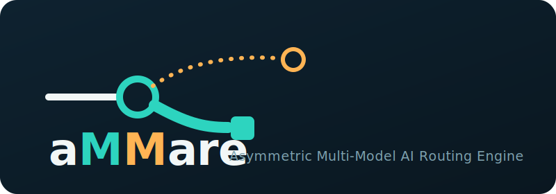

# aMMare - Asymmetric Multi-Model AI Routing Engine

<p align="center">
  
</p>

<p align="center">
  <a href="https://github.com/pre-commit/pre-commit"></a>
  <a href="https://github.com/astral-sh/ruff"></a>
  <a href="https://www.shellcheck.net/"></a>
  <a href="https://github.com/igorshubovych/markdownlint-cli"></a>
  <br>
  
  
  
  
  
</p>

---
## Disclaimer
Note that this project is still in the planning stage; you can check out the architecture doc in pdf of md format below  
[PDF](https://github.com/christopherpaquin/aMMare-Asymmetric-Multi-Model-AI-Routing-Engine/blob/main/architecture/aMMare%20-%20Asymmetric%20Multi-Model%20AI%20Routing%20Engine%20-%20V1.2.pdf)  
[Markdown](https://github.com/christopherpaquin/aMMare-Asymmetric-Multi-Model-AI-Routing-Engine/blob/main/architecture/aMMare%20-%20Asymmetric%20Multi-Model%20AI%20Routing%20Engine%20-%20V1.2.pdf)  

## Pronunciation Guide

Ammare (or aMMare) is pronounced /ˈæm.ɑːɹ/

- **Syllable 1 (/ˈæm/)**: Say the word "am" (as in, "I am"). Make sure the "a" sound is flat and sharp, like the "a" in cat or trap. Drop your jaw slightly and push the sound from the front of your mouth.
- **Syllable 2 (/.ɑːɹ/)**: Say the word "marr" (as in, "This is a non-marring mallet, as I do not want to mar the new flooring during installation."). Pronounce the M, then make a wide, open throat sound like the "ah" sound you make at the doctor, smoothly blending into a standard English "R" sound (like at the end of car or far).

---

## Executive Summary

The **Asymmetric Multi-Model AI Routing Engine (aMMare)** is a containerized agentic AI toolchain designed to provide a practical, local-first development assistant. By separating model reasoning from tool execution, `aMMare` utilizes local and cloud-hosted AI models through a controlled, governed service chain.

Unlike a simple local chatbot, `aMMare` coordinates real developer workflows (such as modifying files, running tests, inspecting logs, and executing Git operations) using a stateful orchestration layer. Routine tasks are routed to local model endpoints (reducing API costs and preserving data privacy), while complex reasoning tasks or failed local iterations are escalated to high-capacity frontier cloud models.

---

## Architecture & Service Chain

The system is designed around a physical service-chain model. Requests flow from the User Interface into the agent layer, through context optimization and routing proxies, and down to the active model endpoint:

```text
[User Interface / OpenHands]
            │
            ▼
[LangChain Agent Middleware]  ◄─── (Tool Execution & Safety Boundary)
            │
            ▼
[Headroom Context Proxy]      ◄─── (Token Optimization & Payload Compression)
            │
            ▼
[LiteLLM Routing Gateway]     ◄─── (Governance, Budgets, and Virtual Keys)
            │
      ┌─────┴────────┐
      ▼              ▼
[vLLM Endpoint]   [Frontier Cloud APIs]
(Local RTX GPUs)   (Claude / GPT-4 / Gemini)
```

### Component Responsibilities

- **User Interface Layer:** The entry point (CLI, Web UI, or IDE integration) where developers submit requests and review execution logs, summaries, and diffs.
- **OpenHands Workspace:** A containerized browser-based workspace functioning as a visual IDE for autonomous coding agent runs.
- **LangChain Agent Middleware:** The stateful controller and execution boundary. It defines prompt templates, governs tool execution (reading/writing files, executing shell commands, running tests), validates model outputs, and determines escalation events.
- **Headroom Proxy:** An inline proxy designed to compress context and optimize token payloads to reduce latency and downstream model costs.
- **LiteLLM Proxy:** The single unified API gateway. It manages model endpoint routing, fallback paths, virtual keys, spend tracking, and quota policies.
- **Local vLLM Model Endpoint:** Multi-GPU local inference runtime running open-source code models. Optimized for routine coding tasks and local privacy.
- **Frontier Model Cloud API:** External API provider endpoint used for complex reasoning, final code reviews, and fallback routing.

---

## **Architecture & Implementation Guides**

The setup, integration, and security implementation steps are documented in detail across the following step-by-step guides:

- **[Implementation Index (README)](file:///home/cpaquin/Workspace/Git/aMMare-Asymmetric-Multi-Model-AI-Routing-Engine/implementation/README.md)**
- **[Phase 0: Repository Scaffold & Baseline Standards](file:///home/cpaquin/Workspace/Git/aMMare-Asymmetric-Multi-Model-AI-Routing-Engine/implementation/phase_0_scaffold.md)**
- **[Phase 1: Local LLM Endpoint (vLLM)](file:///home/cpaquin/Workspace/Git/aMMare-Asymmetric-Multi-Model-AI-Routing-Engine/implementation/phase_1_local_llm.md)**
- **[Phase 2: LangChain Middleware Layer](file:///home/cpaquin/Workspace/Git/aMMare-Asymmetric-Multi-Model-AI-Routing-Engine/implementation/phase_2_langchain_middleware.md)**
- **[Phase 3: Direct Local Model Workflow Validation](file:///home/cpaquin/Workspace/Git/aMMare-Asymmetric-Multi-Model-AI-Routing-Engine/implementation/phase_3_workflow_validation.md)**
- **[Phase 4: LiteLLM Routing Layer](file:///home/cpaquin/Workspace/Git/aMMare-Asymmetric-Multi-Model-AI-Routing-Engine/implementation/phase_4_litellm_routing.md)**
- **[Phase 5: Cloud Model Provider Integration](file:///home/cpaquin/Workspace/Git/aMMare-Asymmetric-Multi-Model-AI-Routing-Engine/implementation/phase_5_cloud_provider.md)**
- **[Phase 6: Routing and Escalation Logic](file:///home/cpaquin/Workspace/Git/aMMare-Asymmetric-Multi-Model-AI-Routing-Engine/implementation/phase_6_routing_escalation.md)**
- **[Phase 7: Headroom Integration](file:///home/cpaquin/Workspace/Git/aMMare-Asymmetric-Multi-Model-AI-Routing-Engine/implementation/phase_7_headroom_integration.md)**
- **[Phase 8: OpenHands Integration](file:///home/cpaquin/Workspace/Git/aMMare-Asymmetric-Multi-Model-AI-Routing-Engine/implementation/phase_8_openhands_integration.md)**
- **[Phase 9: Memory, Context, and Retrieval (RAG)](file:///home/cpaquin/Workspace/Git/aMMare-Asymmetric-Multi-Model-AI-Routing-Engine/implementation/phase_9_memory_retrieval.md)**
- **[Phase 10: Full Service Chain Validation](file:///home/cpaquin/Workspace/Git/aMMare-Asymmetric-Multi-Model-AI-Routing-Engine/implementation/phase_10_full_chain_validation.md)**
- **[Phase 11: One-Click Modular Deployment](file:///home/cpaquin/Workspace/Git/aMMare-Asymmetric-Multi-Model-AI-Routing-Engine/implementation/phase_11_one_click_deployment.md)**
- **[Phase 12: Hardening & Packaging](file:///home/cpaquin/Workspace/Git/aMMare-Asymmetric-Multi-Model-AI-Routing-Engine/implementation/phase_12_hardening_packaging.md)**

---

## **Getting Started & Operations**

This section describes how to **start**, **stop**, and **health-check** the aMMare container stack.

### **1. Starting Services**

Deploy the platform by specifying the target environment profile (default is `minimal-local`).

```bash
# Sourcing profile defaults and deploying the containers
./scripts/deploy.sh -p [minimal-local | hybrid | full]
```

- **minimal-local**: Deploys only `ammare-local-llm` and `ammare-langchain`.
- **hybrid**: Deploys `ammare-local-llm`, `ammare-litellm`, and `ammare-langchain`.
- **full**: Deploys the complete stack (Qdrant, OpenHands, Headroom, LiteLLM, local LLM, and LangChain).

### **2. Stopping Services**

Safely stop all running containers, dismantle internal Docker networks, and clean caches:

```bash
# Normal teardown (retains downloaded model caches)
./scripts/uninstall.sh

# Complete purge (removes all container data volumes and model caches)
./scripts/uninstall.sh -x
```

### **3. Running Health Checks and Validations**

Detects the active deployment profile and fires corresponding network, routing, and functional smoke tests:

```bash
./scripts/validate.sh
```

To run individual service checks manually:

- **Local LLM Health:** `curl http://localhost:8000/v1/models`
- **LangChain Health:** `curl http://localhost:8080/health`
- **LiteLLM Health:** `curl http://localhost:4000/ping`

---

## **Developer Guidelines for AI Coding Agents**

All coding agents operating on this repository must consult and follow the [rules.md](file:///home/cpaquin/Workspace/Git/aMMare-Asymmetric-Multi-Model-AI-Routing-Engine/rules.md) file. Any changes made must be logged in [WORKLOG.md](file:///home/cpaquin/Workspace/Git/aMMare-Asymmetric-Multi-Model-AI-Routing-Engine/WORKLOG.md).
